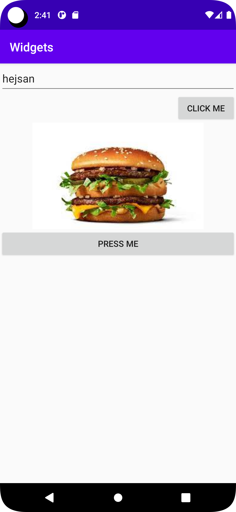

# Rapport

**Skriv din rapport här!**

Valde att implementera en linearlayout istället för constraintLayout.
Tre widgets har lagts till, ImageView, Button och editText.

<EditText
android:layout_width="match_parent"
android:layout_height="wrap_content"
*************************************
Valet blev linearlayout istället för constraintlayout. 
Den röda tråden i de flesta widgets har varit  "match_parent" och wrap_content"
Wrap-content menas med att komponenten i fråga enbart efterfrågat att vara tillräckligt stor för sitt innehåll.
Match-Parent menas med att att komponent i fråga ärver storlek från förälder-komponent. 
 En bild har även tillagts för att visa designfliken, här har sampel mellan design och kodskrivandet uppmärksammats. 
Även dp har använts genom diverse widgets i syfte att skapa storlek i element. Viktigt att notera att DP inte bör vara hårdkodat. 
Layoutgravity har använts för att centrera bilden. 
```android:layout_gravity="center"
app:srcCompat="@drawable/bigmac" />
```

## Följande grundsyn gäller dugga-svar:

- Ett kortfattat svar är att föredra. Svar som är längre än en sida text (skärmdumpar och programkod exkluderat) är onödigt långt.
- Svaret skall ha minst en snutt programkod.
- Svaret skall inkludera en kort övergripande förklarande text som redogör för vad respektive snutt programkod gör eller som svarar på annan teorifråga.
- Svaret skall ha minst en skärmdump. Skärmdumpar skall illustrera exekvering av relevant programkod. Eventuell text i skärmdumpar måste vara läsbar.
- I de fall detta efterfrågas, dela upp delar av ditt svar i för- och nackdelar. Dina för- respektive nackdelar skall vara i form av punktlistor med kortare stycken (3-4 meningar).

Programkod ska se ut som exemplet nedan. Koden måste vara korrekt indenterad då den blir lättare att läsa vilket gör det lättare att hitta syntaktiska fel.


function errorCallback(error) {
    switch(error.code) {
        case error.PERMISSION_DENIED:
            // Geolocation API stöds inte, gör något
            break;
        case error.POSITION_UNAVAILABLE:
            // Misslyckat positionsanrop, gör något
            break;
        case error.UNKNOWN_ERROR:
            // Okänt fel, gör något
            break;
    }
}

```

Bilder läggs i samma mapp som markdown-filen.


Läs gärna:

- Boulos, M.N.K., Warren, J., Gong, J. & Yue, P. (2010) Web GIS in practice VIII: HTML5 and the canvas element for interactive online mapping. International journal of health geographics 9, 14. Shin, Y. &
- Wunsche, B.C. (2013) A smartphone-based golf simulation exercise game for supporting arthritis patients. 2013 28th International Conference of Image and Vision Computing New Zealand (IVCNZ), IEEE, pp. 459–464.
- Wohlin, C., Runeson, P., Höst, M., Ohlsson, M.C., Regnell, B., Wesslén, A. (2012) Experimentation in Software Engineering, Berlin, Heidelberg: Springer Berlin Heidelberg.
